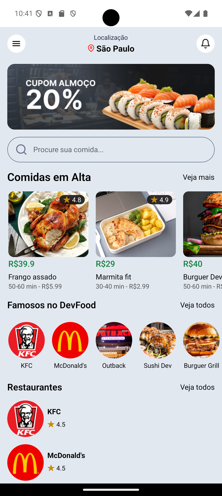
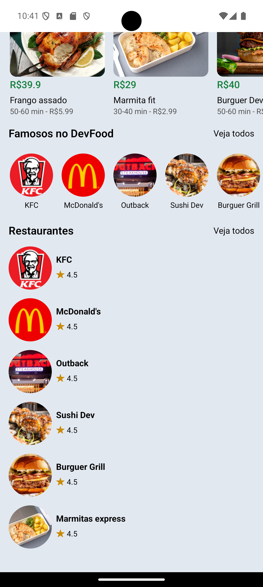

 

# 🍔 App DevFood

Este é um projeto paralelo de um aplicativo de delivery estilo **iFood**, desenvolvido utilizando **React Native**, **Expo** e **NativeWind**. O aplicativo utiliza uma **API "fake"** para consumir dados de forma simples e eficiente, com foco no aprendizado e na prototipagem.

---

## 🚀 Tecnologias Utilizadas

- **React Native**: Para o desenvolvimento de interfaces móveis nativas.
- **Expo**: Para facilitar o desenvolvimento, build e deploy do app.
- **NativeWind**: Estilização eficiente utilizando classes utilitárias do Tailwind CSS.
- **React Navigation**: Para navegação entre telas.
- **JSON Server**: Para criar uma API "fake" e simular o consumo de dados.
- **TypeScript**: Para maior confiabilidade e manutenção do código.

---

## 🎯 Objetivo do Projeto

O aplicativo tem como foco principal:

- Listar restaurantes e comidas disponíveis

---

## 🧩 Principais Dependências
- [NativeWind](https://www.nativewind.dev/) - Tailwind CSS para React Native. 
- [JSON Server](https://github.com/typicode/json-server) - Simulação de API.

---
## 📧 Contato 
- Nome: Gabriel Prado
- E-mail: gabrielpradomartinsgbi@gmail.com
- LinkedIn: [https://www.linkedin.com/in/gabrielprd/](https://www.linkedin.com/in/gabrielprd/)
